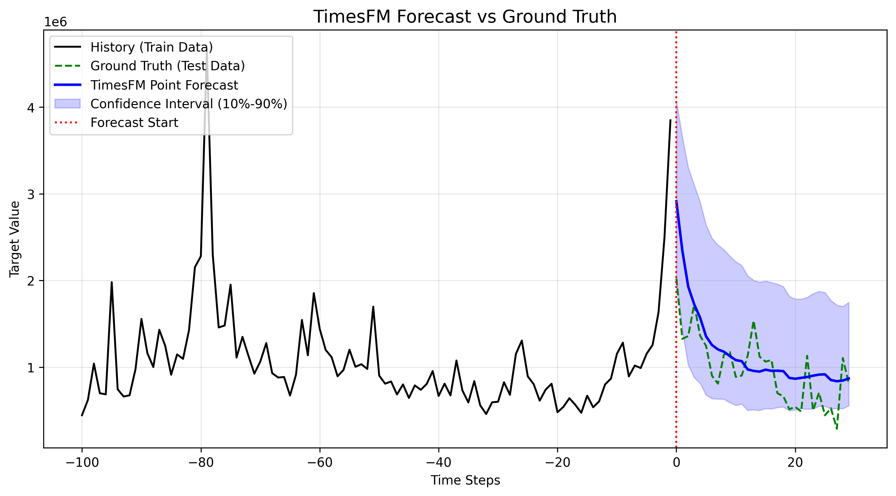

## TimesFM 模型原理解析

### 1. 为什么模型可以准确预测数据到达峰值后的下降趋势，而不是认为数据会持续上升？

TimesFM 作为一个强大的“时间序列基础模型（Time Series Foundation Model）”，之所以能够准确捕捉到数据到达峰值后的回落（Mean Reversion/均值回归）或非线性转折，而不是像传统简单线性回归那样无脑延续上升趋势，核心在于其底层的 **Transformer 架构** 和 **Patching（分块）策略**。

从理论和模型设计的角度分析，其机制如下：

#### 1. Patching（序列分块）机制：从“看单个点”到“看形状”
传统的时间序列模型（如简单的自回归 AR）往往只看前几个数据点的值来推断下一个点，这很容易导致线性外推。而 TimesFM 引入了类似于 Vision Transformer (ViT) 处理图像的 **Patching 机制**。它不会逐个点地去预测，而是将时间序列切分成一个一个的“块”（Patch，例如每 32 个时间点作为一个 Patch）。
- **局部形状感知**：模型不是在看一个点是高还是低，而是在看一个 Patch 内部的“形状”（比如这是一个“冲顶”的形状，还是一个“震荡”的形状）。
- **发现拐点模式**：当模型在它浩如烟海的训练数据（Google 使用了上千亿数据点进行预训练）中见过无数次“急剧上升的 Patch 后面紧跟着一个急剧下降的 Patch”时，它就能识别出这种“波峰（Peak）”模式，从而在遇到相似特征时预测出随后的下降趋势。

#### 2. Decoder-Only Transformer 架构与全局自注意力（Self-Attention）
TimesFM 采用了类似 GPT 的 **Decoder-Only Transformer** 架构。
- **长上下文感知（Long Context）**：TimesFM 2.5 支持高达 16,384 个上下文长度（我们在脚本中设置了 `context_len=512`）。
- **注意力机制（Attention）**：自注意力机制允许模型在预测未来时，去“查阅”历史中任何时刻发生的事情。如果模型在最近的数据中看到了一个急速拉升的波峰，注意力机制会促使它去回顾更早之前的历史——“这只股票/这个指标以前出现这种拉升时，后来发生了什么？”。如果历史规律表明该数据具有很强的**均值回归（Mean Reversion）**特性（即涨得越高，跌得越快），Attention 机制赋予这些历史经验高权重，从而打破短期的线性上升幻觉，预测出转折向下的趋势。

#### 3. 海量多样化数据的预训练（Zero-Shot 能力）
这可能是最关键的一点。TimesFM 被称为“基础模型（Foundation Model）”，是因为 Google 在预训练时使用了包含维基百科页面访问量、全球零售销量、服务器 CPU 负载、气象数据等**各行各业的真实世界时间序列**。
在现实世界中，“无限指数增长”是非常罕见的，绝大多数数据都具有周期性、饱和点或均值回归特性。模型在训练中已经深刻“内化”了这些物理世界和商业世界的非线性动态规律。因此，在 Zero-Shot（不进行微调直接测试）的情况下，当输入一段带有强烈上升趋势的数据时，模型的先验知识告诉它：“这种形态通常意味着即将见顶回落”。

#### 4. 自动输入归一化（Normalize Inputs）
代码配置中开启了 `normalize_inputs=True`。这意味着模型在处理数据之前，会自动对输入的上下文进行缩放，将其拉回一个标准的数值范围内。这使得模型不会被极端的绝对数值（比如股价突然涨到 4000）“吓到”或“带偏”，而是**专注于数据波动的相对形态和方差变化**。这种对形态的专注，极大增强了模型识别“波峰”和“波谷”非线性转折点的能力。

### 2. TimesFM 能否处理多维时间序列并找到不同数据变动之间的联系？

**简短回答**：TimesFM **本质上是一个单变量（Univariate）模型**，它**没有内置跨变量的交叉注意力（Cross-attention）机制**。但是，Google 官方通过引入 **XReg（外部回归，Exogenous Regressors）** 的混合架构，**巧妙地实现了对多维协变量（Covariates）的支持**，从而建立主变量和外部变量之间的联系。

详细原理解析如下：

#### 1. TimesFM 的原生局限：它没有跨变量注意力（Cross-Attention）
**如果你期待像某些专用的多变量 Transformer 模型那样，直接把 close 和 volume 拼成一个矩阵喂进去，让模型自动去计算“当 volume 突然放大时对 close 的 Attention 权重”，TimesFM 是做不到的。**

根据其模型设计，TimesFM 的注意力机制（Self-Attention）是严格沿着时间轴展开的。如果你传入 400 支股票的数据，它在底层是把它们当作 **400 条完全独立的平行时间序列**进行计算（Batch Processing），股票 A 的数据绝不会去 Attention 股票 B 的数据。同样地，主变量（如 `close`）也不会自动去 Attention 协变量（如 `volume`）。

#### 2. 官方的破局之道：TimesFM + XReg 混合架构
**为了解决现实世界中“外部变量影响目标变量”的问题（比如节日促销影响销量，或者交易量 volume 影响股价 close ），Google 官方在 TimesFM 2.5 中引入了 `xreg_lib.py` 库。它支持传入：**

- **动态数值协变量**：随时间变化的数值（如你数据里的 `volume`，或者每天的气温）。
- **动态分类协变量**：随时间变化的类别（如星期几、是否是节假日）。
- **静态协变量**：不随时间变化的属性（如股票所属的行业板块）。

它的原理并非修改 Transformer 本身，而是采用了**组合建模**的思想。官方提供了两种工作模式：

**模式一："timesfm + xreg" (默认推荐)**
1. **纯时间序列预测**：首先，TimesFM 只盯着 `close` 的历史数据看，给出一个“如果只看过去的走势，未来应该怎么走”的基础预测（Baseline）。
2. **残差回归**：然后，系统计算历史真实值与 TimesFM 预测值之间的**误差（残差）**。
3. **寻找联系**：系统使用线性回归模型（Ridge Regression）去学习 `volume`（以及其他协变量）与这个“残差”之间的关系。也就是说，系统在问：“当 TimesFM 预测不准的时候，是不是因为 `volume` 发生了异常变化？”
4. **最终输出**：最终预测值 = TimesFM的基础预测 + XReg根据 `volume` 计算出的调整值。

**模式二："xreg + timesfm"**
1. **外部变量主导**：先用线性回归去拟合 `volume` 和 `close` 的关系。
2. **时间序列兜底**：算出误差后，再让 TimesFM 去预测这个误差在时间维度上的波动。

**总结**：
TimesFM 并没有在深度学习网络内部去做变量间的 Cross-Attention（这会让模型极其庞大且难以做到 Zero-Shot），而是采用了一种**工程上非常聪明且高效的“残差修正”方法**，将“时间维度的非线性规律（交给大模型）”和“不同变量之间的相关性（交给回归模型）”解耦处理。

### 3. 本质上 TimesFM 是一个已经训练好的大模型，那么我给出的 training 数据集发挥了什么作用？

严格来说，在你传入 `train.parquet` 时，**并没有用来“训练” TimesFM 模型本身**（模型的那 2 亿个参数在整个运行过程中没有任何改变，没有计算梯度，也没有反向传播）。

那么，你提供的历史数据（我们称之为 Training Set，但在大模型语境下更准确的叫法是 **Context / 上下文**）到底发挥了什么作用？主要有以下两个维度的作用：

#### 1. 纯时间序列场景下：作为“推理的上下文（Context）”
你可以把 TimesFM 想象成一个阅读理解能力极强的“股神”。Google 已经用全世界的图表（上千亿个点）把它训练成了一个懂看各种走势的专家。
- **没有你的数据**：它空有一身看图的本领，但不知道你具体要看哪只股票。
- **提供你的数据（Context）**：你把 `train.parquet` 中最后 512 个时间点的数据递给它，相当于给它看了一张**“这只股票过去半年的 K 线图”**。
- **作用机制**：它通过这 512 个点，立刻理解了这只股票**当前的波动率大小、当前的绝对价格水位、最近是在走上升通道还是处于震荡期**。然后，它根据自己脑子里（2 亿参数）记下的相似形态的历史经验，直接推断出未来 30 个点（Horizon）最可能怎么走。

> **通俗比喻**：ChatGPT 已经学会了全人类的语言（预训练）。但你必须先对它说一句话（你的输入数据 / Prompt / Context），它才能顺着你的话往下接。你的历史数据，就是给 TimesFM 的 Prompt。

#### 2. 引入协变量（XReg）场景下：作为回归模型的“真实训练数据”
当你使用前文提到的 **“TimesFM + XReg 混合架构”**（引入 `volume`）时，你的历史数据才真正发挥了**传统意义上的“训练（Training）”作用**，但**训练的对象不是 TimesFM，而是外挂的那个线性回归模型**。

以默认的 **"timesfm + xreg"** 模式为例，你的历史数据（比如 512 个点的 `close` 和 `volume`）的作用流程是这样的：
1. **产生回测（Backcast）**：TimesFM 先在你的历史数据上“模拟预测”一遍过去的日子，得到一条预测线。
2. **计算历史误差**：系统拿你提供的真实的 `close` 减去 TimesFM 的模拟预测线，得到 512 个点的误差值（残差）。
3. **即时训练线性回归（Training）**：系统在这一瞬间，**用你提供的这 512 个点的真实 `volume` 作为特征（X），用上一步的误差作为目标（Y）**，现场拟合（Fit / Train）出一个微型的线性回归模型（Ridge Regression）。
4. **纠正未来**：在预测未来时，这个现场训练好的小模型会根据未来的 `volume` 去修正 TimesFM 的未来预测。

#### 总结
你提供的 `train.parquet` 数据：
1. **对于 TimesFM 主网络**：它是 **Context（上下文）**，用来告诉模型“现在是什么情况”，供模型进行 Zero-Shot 推理（前向传播），不改变任何权重。
2. **对于外挂的 XReg 协变量模块**：它是 **Training Data（训练集）**，用来现场拟合（Fit）目标变量和外部变量之间的系数，量身定制一个残差修正模型。

这正是 Foundation Model（基础模型）时代带来的最大范式转变：**“预训练模型（通用规律） + 局部上下文（个性化输入） = 强大且无需微调的预测”**。
